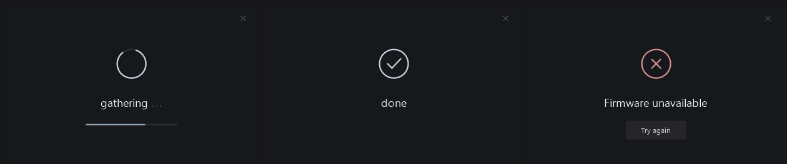
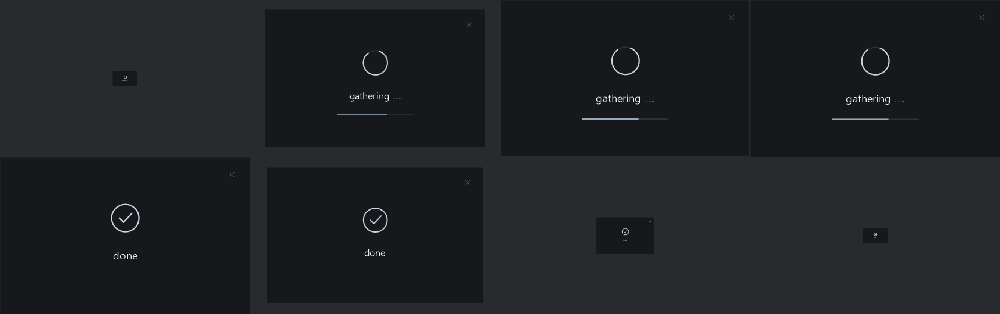

<div align="center">

# secure-hwid

simple hwid profiler for security purposes

[](https://github.com/itzzzryze/secure-hwid/releases/latest)
[](#usage)
[](#building)
[](#report-format)



<sub>UI states rendered with the application drawing code.</sub>

</div>

## method

secure-hwid collects hardware identifiers through Windows device and firmware interfaces. A deterministic SHA-256 digest identifies the collected configuration.

| Component | Collection method | Requirement |
| --- | --- | --- |
| NVRAM | `NtEnumerateSystemEnvironmentValuesEx`; selected firmware variables | Required |
| GPU PCI ID | [SetupAPI](https://learn.microsoft.com/en-us/windows/win32/api/setupapi/nf-setupapi-setupdigetdeviceinstanceidw); present PCI display devices | When available |
| NVIDIA UUID | [NVML](https://docs.nvidia.com/deploy/nvml-api/group__nvmlDeviceQueries.html); `nvmlDeviceGetUUID` | When available |
| TPM fingerprint | Platform Crypto Provider; SHA-256 of the endorsement public key | When available |
| C: storage serial | Volume disk extents, then [StorageDeviceProperty](https://learn.microsoft.com/en-us/windows/win32/api/winioctl/ns-winioctl-storage_device_descriptor) on the backing disk | Required |

The firmware input consists of `OfflineUniqueIDEKPub`, `OfflineUniqueIDEKPubCRC`, `OfflineUniqueIDRandomSeed`, `OfflineUniqueIDRandomSeedCRC`, and `UnlockIDCopy`. At least one nonempty value must exist. Vendor GUIDs and variable names identify each value; record padding is excluded.

Let `E` encode sorted fields as `HWID || 0x02`, followed by length-prefixed names and values. Lengths are unsigned 32-bit little-endian integers.

```text
N = SHA256(E(firmware values))
HWID = Base64(SHA256(E(N, available GPU/TPM values, C: serial)))
```

GPU values are sorted and deduplicated. The C: mapping and storage serial are read twice. Missing serials and C: volumes spanning distinct disks stop collection. Other drives are excluded.

## report format

The decrypted JSON contains `hwid`, `nvram`, `tpm_fingerprint`, `gpu_serial_source`, `gpu_serials`, `gpu_uuids`, and `c_drive.storage_query_property_serial`. `gpu_serials` contains PCI device-instance IDs. Missing TPM data is `null`; missing GPU sources produce empty arrays.

UTF-8 JSON is encrypted with AES-256-GCM. Key derivation uses PBKDF2-HMAC-SHA256 with 600,000 iterations and a random 16-byte salt. Each report has a random 12-byte nonce and a 16-byte authentication tag.

```text
Base64("HWEN" || 0x01 || salt[16] || nonce[12] || tag[16] || ciphertext)
```

The first 33 bytes are authenticated as AAD. Discord receives the ciphertext, raw AES key, nonce, tag in hex and Base64, and AAD in one message. Ciphertext over 1,000 characters uses numbered fields; concatenate them in order. Reports above 4,800 Base64 characters are rejected before delivery to fit [Discord's embed limits](https://docs.discord.com/developers/resources/message#embed-limits).

The client writes no report files and sends no attachments. Delivery uses HTTPS; `done` requires Discord confirmation. Anyone with access to the message can decrypt the report. AES derivation remains in the client for this version.

## usage

Download [HWID.exe](https://github.com/itzzzryze/secure-hwid/releases/latest/download/HWID.exe). Open PowerShell as administrator in that folder:

```powershell
$env:SECURE_HWID_WEBHOOK = Read-Host 'Discord webhook URL'
.\HWID.exe
```

Use a standard `https://discord.com/api/webhooks/` URL without query parameters. The destination is read at runtime. Missing configuration stops collection. The executable is unsigned.

The customer interface shows collection, delivery and completion. It has no report viewer, export or decryption controls. After a delivery timeout, check Discord before retrying; the message may already exist.

## limits

PCI IDs depend on device configuration. RAID controllers may report a logical disk serial. Hardware changes or unavailable sources can change the HWID. Hashing provides no proof of hardware authenticity.

AES key buffers use locked pages, scoped access and [CryptProtectMemory](https://learn.microsoft.com/en-us/windows/win32/api/dpapi/nf-dpapi-cryptprotectmemory). Sensitive buffers are erased after use. The build enables CFG, ASLR, DEP and stack checks. Privileged debuggers and modified kernels can still inspect the process.

## building

Requires Visual Studio 2022 Community with the C++ desktop workload, installed at the standard path.

```powershell
.\build.bat
.\test.bat
.\test_delivery.bat
```

`build.bat` produces only `HWID.exe`. Decryption helpers are isolated in `test_support.h` for in-memory verification. Tests cover parser bounds, disk selection, hash composition, AES-GCM vectors, tamper rejection, chunked messages and webhook configuration. Delivery tests run locally; `--send-test` sends a synthetic report. `probe.bat` and `probe_hardware.bat` check live GPU and C: reads without printing identifiers.

<details>
<summary>animation frames</summary>



`preview.bat` renders the UI states and motion samples. Opening scales from 0.1 to 1.0 over 920 ms; closing shrinks and fades over 620 ms. Windows' reduced-motion setting is respected.

</details>
